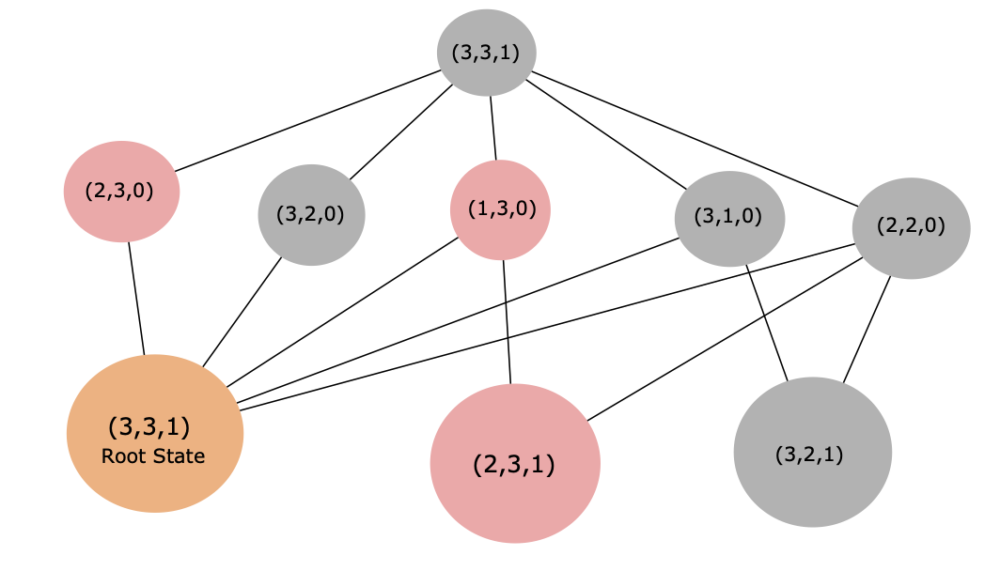
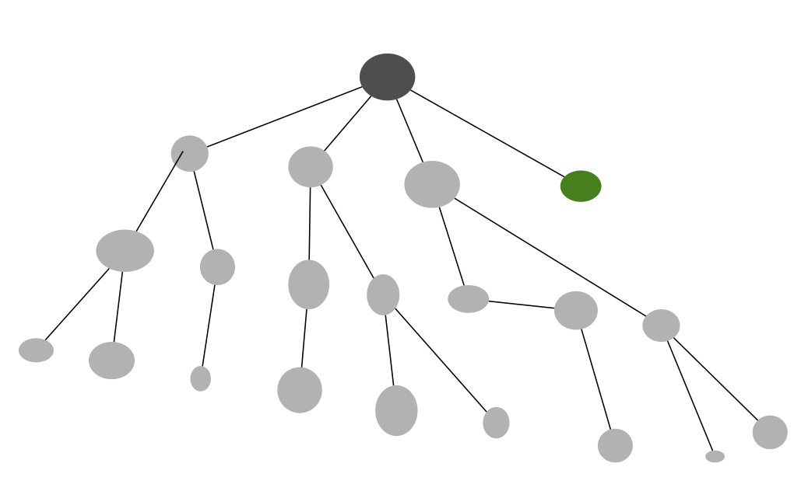

# PA1 Report

## Jack Keane

### Initial Discussion and Introduction

The upper bound for the number of states is `(# of chickens + 1) * (# of foxes + 1) * # of possible boat locations`, which for the basic case is `4 * 4 * 2 = 32`. For the first two factors, it is dependent on the number of chickens and foxes respectively. If there are `n` chickens, then a given state could have `0, 1,...,n` chickens, which is `n+1` possibilities. The same applies for foxes. As the boat can be either on the west or east bank, there are 2 possibilities. Of course there are impossible states that would require the boat to travel empty ((3, 3, 0)) and illegal states where chickens get eaten, but we do not account for that to find the upper bound.

#### Graph of initial first two rounds of states

A requirement I have in order to take a 'step' between states is for the boat to cross the river. So, there are 5 possible ways to pick either 1 or 2 animals to cross the river (assuming there are enough chickens and foxes). Then in the next iteration of states, if there is only 1 animal on the east side of the river, then it must return in order to bring back the boat. If there are 2 animals, then either or both of them can return. Illegal states are colored red, and repeated states are colored orange (in this case it is just the root case).

### Code design

Looking at the initial code, `FoxProblem` is a way to represent and derive states specifically for the fox and chickens problem, `SearchSolution` is essentially a dictionary with a special `toString` method, and `uninformed_search` is a generic implementation of uninformed search algorithms.

### Building the model

In order to determine the successors in the `get_successors` method, I first consider the 5 possible traverses. Depending on the location of the boat, the traverse will add or subtract from the state (representing animals leaving/arriving to the west bank). Of course, this could create an illegal case, which is checked in the `is_safe` method. The two areas of 'illegality' is (a) more foxes than chickens, which violates the problem premise, and (b) invalid number of animals, such as <0 or >3 (if start_state is (3,3,1)) foxes/chickens at a bank.

### Breadth-first search

Not much to say here. Used a `set` to determine if a given state has already been visited, and used a `deque` to implement a queue. when the current node within the search as the goal node, then backchaining occurred, and its result was returned.

### Memoizing depth-first search

No it does not, the 'memo' would scale at the same rate as the 'visited' set in BFS. Furthermore, if the memoized DFS is recursive, then it will consume even more memory as the memo exists in every level of recursion. Thus, memoizing DFS uses even more memory than BFS at a ratio of `m`.

### Path-checking DFS

The `solution` object is essentially global as it's address gets passed through every level of recursion, so it can always be referenced. I leverage this by incrementing the `nodes_visited` instance variable everytime `dfs_search` is called, and I also check the instance variable of the path, as it is empty until a solution is found. Lastly, `backchain` is used to build the current path for checking purposes.

Yes. Path-checking DFS scales by `m` which is the maximum depth of the graph, while BFS scales by `b^d` which is much higher than `m` at scale. Recursion does consume a lot of memory (although it scales at a constant rate), so ideally, the implementation would not be recursive, but memory is saved with path-checking DFS regardless.

In the graph below, we have the dark grey node as the start/root and the green node as the end/goal. If the DFS algorithm considered the left most nodes first, then all other nodes will have to be visited before finding the goal node. Whereas BFS, with the same left-to-right process, would find the goal after visiting 5 nodes (includes root node). This shows that DFS can struggle in large graphs where the goal is reletively close.

### Iterative deepening search

Fortunately, `dfs_search` has a parameter for 'maxdepth' which gets decremented with every level of recursion, so the max depth of an iteration can be controlled. The iterative process stops when a solution with a non-empty path is returned. This signifies that a solution was found.

With respect to memory, path-checking DFS would be preferable as it's space complexity is constant instead of exponential. With respect to time, it would be better to memoize DFS as it would prevent repeated visits to nodes, but it would be a worse version of BFS as IDS is more time expensive due to multiple iterations (where they do not reach the goal) and more memory expensive as it uses a unique memo at each layer of recursion. Therefore, IDS with memoizing is obsolete to BFS, so with respect to time, BFS is preferable.

### Lossy chickens and foxes

The state for this problem would have an additional value, E, that represents the maximum number of chickens that can be eaten. Then, when checking if a new state is valid, we find if chickens would be eaten. Then we determine if the number of chickens to be eaten is less than or equal to the current value of E, if so, we decrement E (and total_chickens if eaten on starting bank) by that value. From there, the current number of chickens can be inferred with the starting values for total_chickens and E as well as the current value of E.

Then the upper bound of possible states is `(total_chickens + 1) * (total_foxes + 1) * total_banks * (max_eaten + 1)`. Of course some states are not feasible, like in the initial discussion of upper bound of possibilities, but now there is the impossible case where there are more chickens than allowed due to chickens being eaten (e.g. start_state = (3,3,1,2) and curr_state = (3,3,1,0) where 2 chickens has been eaten).